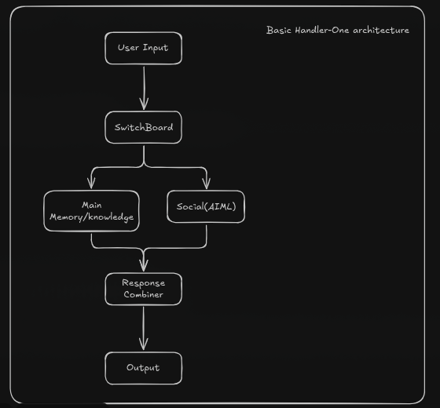

# Handler-One
## A Symbolic Triple-Store Assistant(STSA). 

Basically a Symbolic 'AI' that uses uses triples.
I have absolutely no fucking idea what im doing, but this seems fun to make lol.
Also the reason im not making a 'real' AI (ML) is cuz shitbox PC and yknow, ML has been done to death and is kinda boring to me, so here we are with a symbolic one.

## Goals:
- Can hold basic convo. 
- Has common sense and basic knowledge. 
- Under 1GB RAM and works decently fast on my shitbox

## Architecture:

## Versioning:
Handler-{vibes based version number} [Major.Minor.Patch]\
ie: Handler-One [1.122.833]

## License

MIT

## Disclaimer:
The names are in fact inspired by the 86 anime(and LN!) series. My goat Asato Asato please dont sue the shit out of me, i just really like the names 